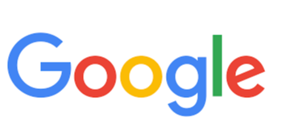

# google
GSG.Ass
<!DOCTYPE html>
<html>
<head>
	<meta charset="utf-8">
	<title>Google</title>
	<link rel="stylesheet" type="text/css" href="style/style.css">
	<link rel="icon" type="image/png" href="goog.png">
</head>
<body>
  

   		<ul>
  			<li></li>
  			<li></li>
  			<li><a href="https://www.google.ps/imghp?hl=en&tab=wi&authuser=0&ogbl" target="_blank"> images</a></li>
  			<li><a href="https://www.gmail.com" target="_blank">Gmail</a></li>
  		</ul>
  		
  	  

           
  	  	
  	  	  

  	  

  	  	<form>
  	  		<input type="search" name="">
  	  	</form>
  	  

  	  

  	  	<form>
  	  		<button>Google Search</button>
  	  		<button >I’m Feeling Lucky</button>
  	  	</form>
  	  	
 Google offered in : العربية 

  	  

  	  

  	  	<footer>Palestine 
  	  		

  	  		<ul>
  	  			<li> <a href="https://ads.google.com/intl/en_ps/home/?subid=ww-ww-et-g-awa-a-g_hpafoot1_1!o2&utm_source=google.com&utm_medium=referral&utm_campaign=google_hpafooter&fg=1">Adversting</a></li>
  	  			<li><a href="https://www.google.com/services/?subid=ww-ww-et-g-awa-a-g_hpbfoot1_1!o2&utm_source=google.com&utm_medium=referral&utm_campaign=google_hpbfooter&fg=1#?modal_active=none">business</a></li>
  	  			<li><a href="https://about.google/?utm_source=google-PS&utm_medium=referral&utm_campaign=hp-footer&fg=1">About</a></li>
  	  			<li><a href="https://www.google.com/search/howsearchworks/?fg=1">How search works</a></li>
  	  		</ul>
  	  		<ol>
  	  			<li>settings</li>
   	  			<li> <a href="https://policies.google.com/terms?hl=en-PS&fg=1">terms</a></li>
  	  			<li><a href="https://policies.google.com/privacy?hl=ar-PS&fg=1">privacy</a></li>
  	  			
  	  		</ol>
  	  	</footer>
  	  

</body>
</html>
